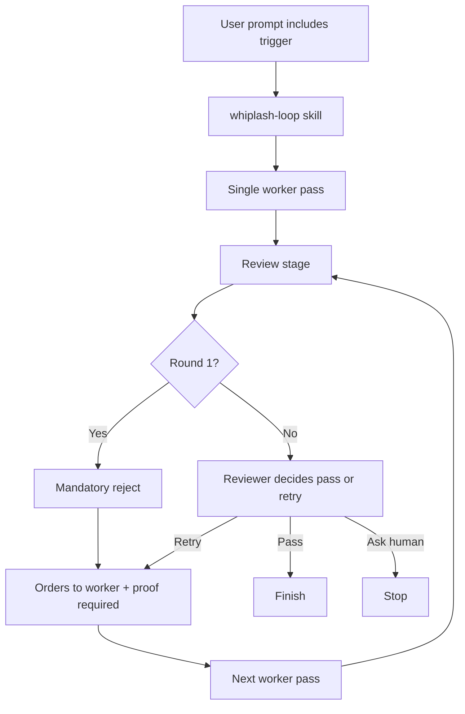
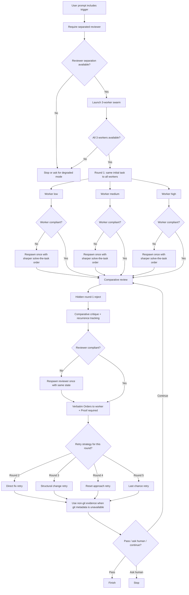

# Whiplash Loop

`whiplash-loop` is a Whiplash v2 orchestration repo with a Codex skill contract and Claude Code project subagents for Fletcher-style, proof-first retry loops triggered by `위플래쉬` or `플레처소환`.

## What It Does

- uses `whiplash-reviewer` as a separated Fletcher orchestrator
- hides the round-1 mandatory reject from workers
- runs a default 3-worker swarm (`low`, `medium`, `high`)
- maps Claude workers to `haiku`, `sonnet`, and `opus`
- gives the same initial task to all three workers in round 1
- compares worker outputs before retrying
- allows lead-worker or role-split retries only after the first comparative review
- lets the reviewer explicitly preserve, combine, or discard worker strengths after the first comparative review
- pushes short, forceful English worker orders with proof requirements
- stops instead of silently degrading when full reviewer separation or full 3-worker fan-out is unavailable
- retries noncompliant workers or reviewers once before accepting malformed loop behavior
- uses non-git verification evidence when the task runs outside a Git repository
- rotates retry strategy across rounds instead of repeating the same failed move
- tracks recurrence plus a prevention note for defect classes that keep returning
- supports structured verdict data for internal loop control

## Main Files

- `.codex/skills/whiplash-loop/SKILL.md`
- `.codex/skills/whiplash-loop/agents/openai.yaml`
- `.codex/skills/whiplash-loop/references/whiplash-reviewer-profile.md`
- `.codex/skills/whiplash-loop/references/whiplash-reviewer-verdict.schema.json`
- `.codex/agents/whiplash-reviewer.toml`
- `.codex/agents/whiplash-worker-low.toml`
- `.codex/agents/whiplash-worker-medium.toml`
- `.codex/agents/whiplash-worker-high.toml`
- `.codex/agents/whiplash-reviewer-verdict.schema.json`
- `.claude/agents/whiplash-reviewer.md`
- `.claude/agents/whiplash-worker-low.md`
- `.claude/agents/whiplash-worker-medium.md`
- `.claude/agents/whiplash-worker-high.md`

## Legacy Flow

This was the earlier reviewer-led loop before the orchestrated v2 redesign.

## Current Flow

This is the current Whiplash v2 design.

## Runtime Notes

- Full Whiplash v2 requires reviewer separation and the full 3-worker swarm. If either is unavailable, the loop should stop and ask for degraded mode instead of silently collapsing.
- Claude Code project subagents mirror the Codex worker roles with `low -> haiku`, `medium -> sonnet`, `high -> opus`, and an `opus` reviewer.
- Round 1 is always the same task to all workers. Early topic split is not part of the design.
- Worker or reviewer noncompliance is retried once before the loop accepts that failure mode as real.
- After the first comparative review, the reviewer may explicitly say which worker strengths to preserve, combine, or discard in the next pass.
- On fail rounds, `Orders to worker` should be shown verbatim before any higher-level explanation.
- Outside Git repositories, verification should rely on file contents, hashes, byte checks, listings, or targeted command output rather than failing `git diff` as core evidence.
- Retry strategy rotates across rounds: direct fix, structural change, reset approach, then last chance.
- Evidence must cover build-or-equivalent output, changed behavior, at least one failure path, and no-regression confidence.
- Repeated defect classes should be surfaced through `recurrence` and `prevention_note`.

## Note On The Logo

This repository now uses the supplied reference image directly as the logo asset.
