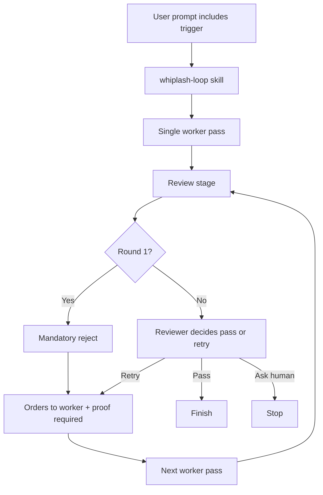
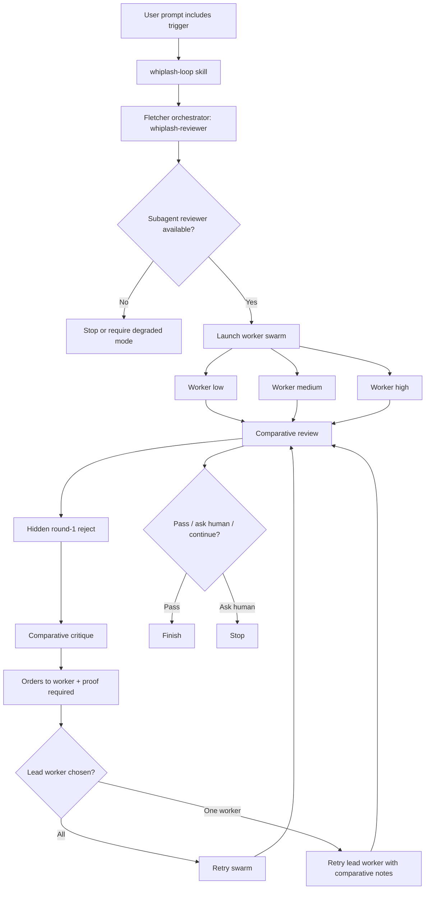

# Whiplash Loop

`whiplash-loop` is a Codex skill for Fletcher-style, proof-first retry orchestration triggered by `위플래쉬` or `플레처소환`.

## What It Does

- uses `whiplash-reviewer` as a separated Fletcher orchestrator
- hides the round-1 mandatory reject from workers
- runs a 3-worker swarm (`low`, `medium`, `high`) for meaningful code tasks
- compares worker outputs before retrying
- pushes short, forceful English worker orders with proof requirements
- supports structured verdict data for internal loop control

## Main Files

- `.codex/skills/whiplash-loop/SKILL.md`
- `.codex/skills/whiplash-loop/agents/openai.yaml`
- `.codex/skills/whiplash-loop/references/whiplash-reviewer-profile.md`
- `.codex/skills/whiplash-loop/references/whiplash-reviewer-verdict.schema.json`
- `.codex/agents/whiplash-reviewer.toml`
- `.codex/agents/whiplash-worker-low.toml`
- `.codex/agents/whiplash-worker-medium.toml`
- `.codex/agents/whiplash-worker-high.toml`
- `.codex/agents/whiplash-reviewer-verdict.schema.json`

## Legacy Flow

This was the earlier reviewer-led loop before the orchestrated v2 redesign.

## Current Flow

This is the current Whiplash v2 design.

## Note On The Logo

This repository now uses the supplied reference image directly as the logo asset.
